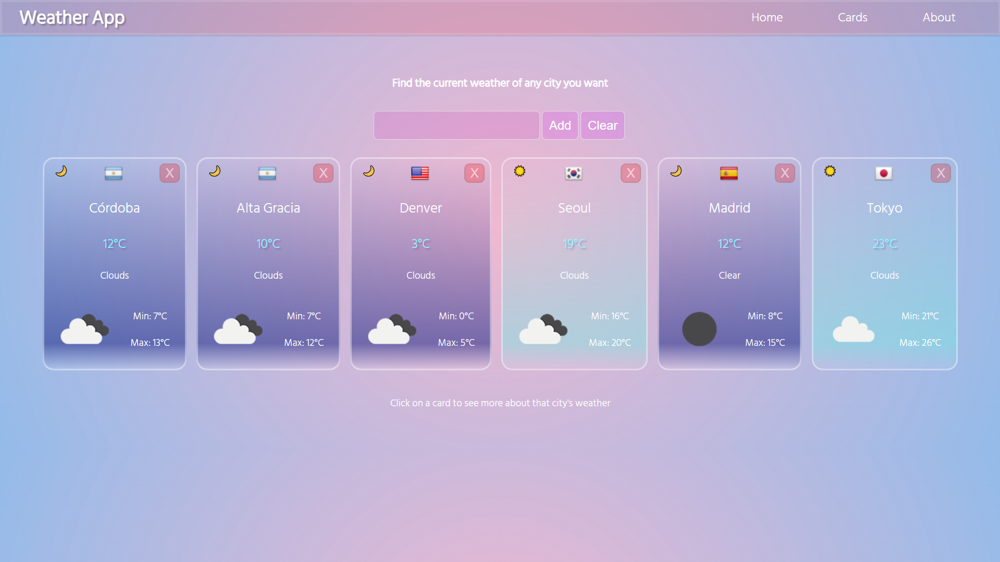

# WeatherApp

You can visit this project deployed [here](https://weather-app-pink-seven.vercel.app/). Also here is a presentation [video](https://www.youtube.com/watch?v=QfT3XzXaM6s).

### This is a front-end project developed with React. Its function is to show the weather of every city in the world, you can type the name of any city on the searchbar and you'll see a card with all the information. The app was made using react hooks and react router. The data is fetched from an open weather API using Axios. The deployment of the application was made with Vercel.

